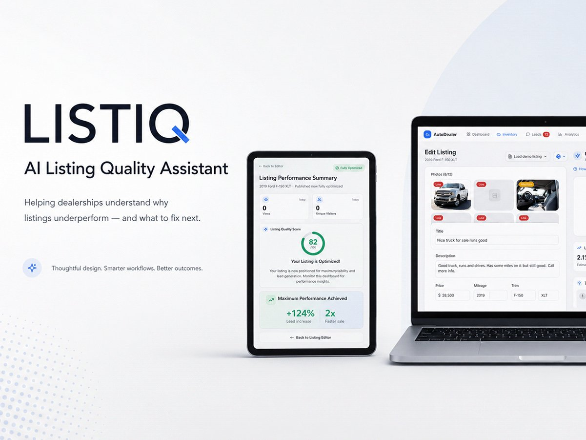

# ListIQ: Listing Quality Assistant

**An AI assistant inside a car dealer's listing editor. It scores the listing, ranks the fixes that matter most, and explains why each one helps.**

[**Live prototype**](https://listing-quality-assistant.vercel.app/) · [**Case study**](https://www.szn4.design/dealer-listing-optimization-platform/)



## The problem

Dealers listing dozens of cars a week publish thin listings ("Nice truck for sale runs good") with one photo and a price out of step with the market, and get no feedback beyond falling views. ListIQ turns listing creation from a task into a coaching moment.

## What it does

- **Live quality score** while the dealer edits, broken down by photos, title, description and price
- **Top 3 Quick Wins,** each with a priority badge and a plain-language reason ("Your price is 7% above similar listings")
- **Guided fixes** for photos, title, description and price
- **Lead likelihood with a confidence label,** so predictions aren't presented as certain
- **"How recommendations are generated"** drawer, one click from the assistant
- **Before/after preview** and a post-publish performance dashboard
- **Demo listings** to load and try the flow

The assistant only suggests. Nothing changes until the dealer applies a fix.

## Built with

React 18 · TypeScript · Vite · Tailwind CSS · shadcn/ui (Radix) · Recharts · React Router

Built with AI-assisted development (Lovable) and deployed on Vercel.

## Run it locally

Requires Node.js 18 or newer.

```bash
npm install
npm run dev
```

Then open the local URL Vite prints (usually http://localhost:8080).

| Script | What it does |
|---|---|
| `npm run dev` | Start the dev server |
| `npm run build` | Production build to `dist/` |
| `npm run preview` | Preview the production build |
| `npm run lint` | Lint the project |

## Project structure

```
src/
  pages/        ListingEditor, FixPhotos, FixTitle, FixDescription, FixPrice,
                PostPublishDashboard
  components/   scores/ (CircularScore, QuickWins, ScoreCard)
                drawers/ (HowAIWorksDrawer, ScoreDrawer)
                dashboard/ (OptimizationDashboard), DemoListingSelector …
  components/ui shadcn/ui primitives
```

## Notes

Concept study and portfolio piece. Scores, lead likelihood and uplift figures are **mock data** that show the experience. They are not measured outcomes.

---

Designed and built by **Sabrina Mohammed** · [szn4.design](https://www.szn4.design/) · [LinkedIn](https://www.linkedin.com/in/sabrina-mohammed-31694483/)
